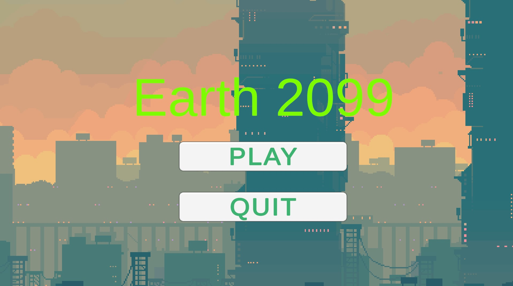
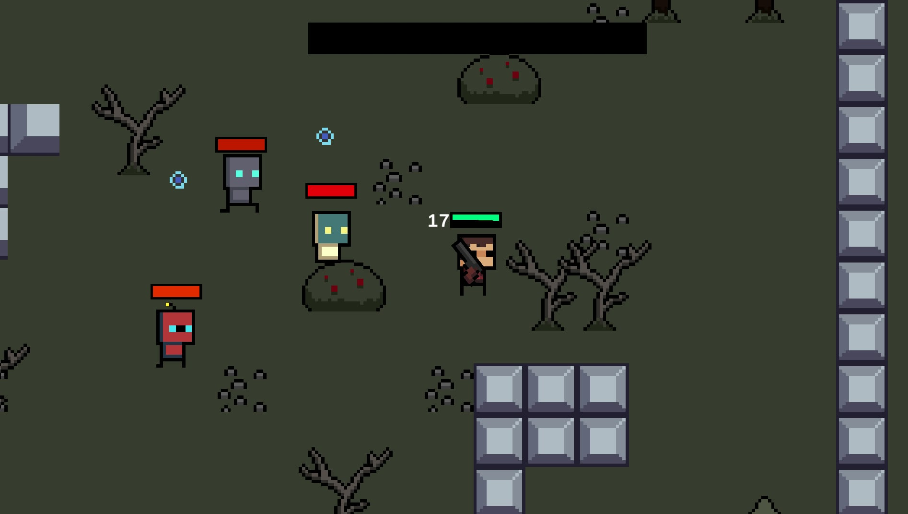
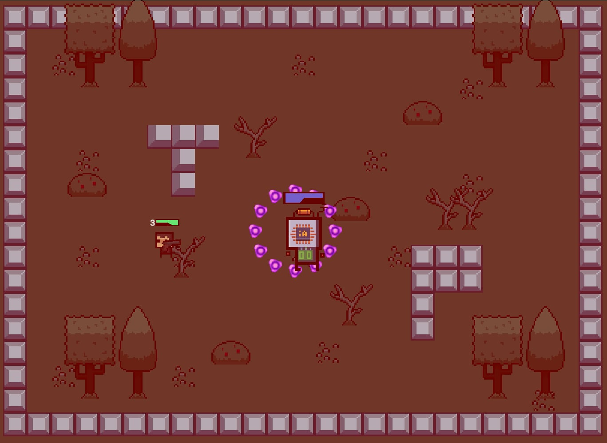
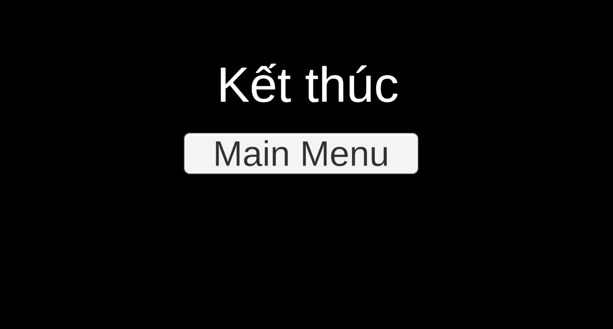

# 🔥 RogueFire

A top-down 2D shooter built with **Unity 6** — battle through waves of unique enemies and take down the ultimate Boss to survive.


---

## 🎮 Gameplay

Navigate a top-down arena and eliminate all enemies to trigger the Boss fight. Survive long enough to defeat the Boss and claim victory.

---

## 👾 Enemy Types

| Enemy               | Behavior                                                         |
| ------------------- | ---------------------------------------------------------------- |
| **Basic Enemy**     | Standard melee/ranged attacker                                   |
| **Heal Enemy**      | Regenerates HP over time — take it down fast                     |
| **Energy Enemy**    | Drops an Energy Orb on death — collect enough to summon the Boss |
| **Explosion Enemy** | Explodes on death — keep your distance                           |
| **Boss**            | Summoned when enough Energy is collected — defeat it to win      |

---

## 🕹️ Controls

| Input                | Action |
| -------------------- | ------ |
| `W A S D`            | Move   |
| `Right Mouse Button` | Shoot  |
| `Left Mouse Button`  | Reload |
| `P` / `Esc`          | Pause  |

---

## 🏆 Win Condition

Collect Energy Orbs dropped by Energy Enemies → summon the Boss → defeat the Boss → **You Win!**

---

## 🛠️ Tech Stack

| Tool            | Version        |
| --------------- | -------------- |
| Unity           | 6 (6000.4.5f1) |
| Language        | C#             |
| Render Pipeline | Built-in (2D)  |
| Camera          | Cinemachine    |
| UI              | TextMesh Pro   |
| Tilemap         | Unity Tilemap  |

---

## 📁 Project Structure

```
Assets/
├── Animation/       # Animator controllers & clips
├── Audio/           # Sound effects & BGM
├── Cursor/          # Custom cursor assets
├── Prefabs/         # Enemy, bullet, FX prefabs
├── Scenes/          # Game scenes
├── Scripts/         # All C# game logic
├── Settings/        # Input & render settings
├── Sprites/         # Character & environment sprites
├── TextMesh Pro/    # TMP resources
└── Tiles/           # Tilemap tiles
```

---

## 🚀 Getting Started

### Requirements

- [Unity Hub](https://unity.com/download)
- Unity Editor **6000.4.5f1** (or compatible 6.x version)

### Run Locally

```bash
# 1. Clone the repo
git clone https://github.com/nhattan3/roguefire.git

# 2. Open Unity Hub → Add → select the cloned folder

# 3. Open the project in Unity 6

# 4. Open scene: Assets/Scenes/SampleScene.unity

# 5. Hit Play ▶
```

---

## 📸 Screenshots






---

## 📌 Notes

> This is a **demo build** — currently features 1 level with full enemy variety and Boss fight.
